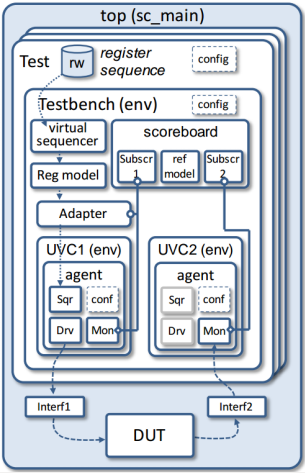
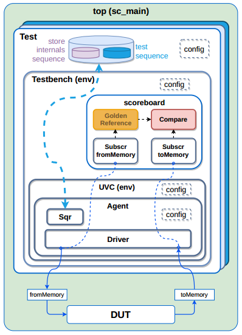

This README gives an overview of the test suite built using UVMSYSTEMC and used with ESL implementations of RISCV processor.

**Content:**
- *Documentation*: includes UVMSYSTEMC reference manual and DVCON-2015 introduction of UVMSYSTEMC.
- *Golden_Reference*: ESL implementation of the RISCV processor that is used as a reference model when testing.
- *Tests*: a collection of scenarios that could be used as programs to run on the processor.
- *vip_components*: includes the universal verification components used by the test suite regardless of what test is running.
- *Top.cpp*: includes the configurations for what test to run and what implementation to test.

# Universal Verification Methodology (UVM) and UVMSYSTEMC:

UVM is used to create modular, scalable, configurable and reusable testbenches based on verification components with standardized interfaces. it's also an Environment
supporting migration from directed testing towards Coverage Driven Verification (CDV) which consists of automated stimulus generation, independent result checking and
coverage collection. But the application is responsible for coverage and randomization definition; UVM only offers the hooks and technology (classes).

### Main concepts of UVM

-   Clear separation of test stimuli (sequences) and test bench:
    - Sequences are treated as ‘transient objects’ and thus independent from the test bench construction and composition.
    - In this way, sequences can be developed and reused independently.
-   Introducing test bench abstraction levels:
    - Communication between test bench components based on transaction level modeling (TLM).
    - Register abstraction layer (RAL) using register model, adapters, and predictors.
-   Reusable verification components based on standardized interfaces and responsibilities:
    - Universal Verification Components (UVCs) offer sequencer, driver and monitor functionality with clearly defined (TLM) interfaces.
-   Non-intrusive test bench configuration and customization:
    - Hierarchy independent configuration and resource database to store and retrieve properties everywhere in the environment.
    - Factory design pattern introduced to easily replace UVM components or objects for specific tests.
    - User-defined callbacks to extend or customize UVC functionality.
-   Well defined execution and synchronization process:
    - Simulation based on phasing concept: build, connect, run, extract, check and report. UVM offers additional refined run-time phases.
    - Objection and event mechanism to manage phase transitions.
-   Independent result checking:
    - Coverage collection, signal monitoring and independent result checking in scoreboard are running autonomously.

### Why UVM in SystemC?
-   Elevate verification beyond block-level towards system-level:
    - System verification and Software-driven verification are executed by teams not familiar with SystemVerilog and its simulation environment.
    - Trend: Tests coded in C or C++. System and SW engineers use an (open source) tool-suite for embedded system design and SW dev.
-   Structured ESL verification environment:
    - The verification environment to develop Virtual Platforms and Virtual Prototypes is currently ad-hoc and not well architected.
    - Beneficial if the first system-level verification environment is UVM compliant and can be reused later by the IC verification team.
-   Extendable, fully open source, and future proof:
    - Based on Accellera’s Open Source SystemC simulator.
    - As SystemC is C++, a rich set of C++ libraries can be integrated easily.
-   Support analogue DUTs with SystemC AMS
-   Reuse tests and test benches across verification (simulation) and validation (HW-prototyping) platforms:
    - requires portable language like C++ to run tests on HW prototypes, measurement equipment, ....
    - Enables Hardware-in-the-Loop simulation and Rapid Control Prototyping.

### UVM Layered Architecture

- The top-level (e.g. sc_main) contains the test(s), the DUT and its interfaces.
- The DUT interfaces are stored in a configuration database, so it can be used by the UVCs to connect to the DUT.
- The test bench contains the UVCs, register model, adapter, scoreboard and (virtual) sequencer to execute the stimuli and check the result.
- The test to be executed is either defined by the test class instantiation or by the member function run_test.

# UVMSYSTEMC structure with RISCV

The general architecture of RISCV processors targeted with our test suite are built using SystemC-PPA methodology (refer to SCAM tool manual for further information
about SystemC-PPA). And the core of the RISCV processor should include one set of communicating ports connecting it to the memory:

    // Ports (Memory Interface)
    blocking_out<CUtoME_IF> COtoME_port;
    blocking_in<MEtoCP_IF> MEtoCO_port;

Giving the nature of our designs under test and the type of interfaces connecting it to the environment, some changes were made to the general architecture of the
UVM-SYSTEMC testing suite.

### Blocking Interfaces:

The general architecture of the UVM test suite requires that an active agent should have a monitor that's capable of "peeking" on the outgoing message to the DUT
(sent on "MEtoCO_port") without actually disturbing that communication and send this message to the scoreboard.

But the issue with the blocking interface used with our targeted RISCV DUT implementations is that the monitor was preceding the DUT to reading the message, and as a
result, the DUT wasn't receiving any new message (instruction). To solve this issue we use the driver itself to send the DUT message back to the scoreboard.

### Interactive sequences:

When attempting to run a full program test on the DUT it's important to feed the DUT sequentially valid instructions and data. This means that the sequence containing
the program-to-run-on-the-core should be able to send to the DUT the right instruction (on the "MEtoCO_port" interface) from the right address that the DUT request
(on the "COtoME_port" interface). To manage this issue we use the driver's reply to each sequence item as a new instruction request coming from the DUT. And this will
require that the same drive will also have the "COtoME_port" DUT interface and of course its corresponding item_collected_port to the scoreboard.

### One Interface require One UVC:

After handling the two issues mentioned earlier it became clear that only one UCV component is needed for handling the memory interface with the DUT. For future
implementations with more than just the memory interface (for example, when having interrupt sources connected to the DUT) it will be possible to add more UVC components
to separate different signal interfaces to the DUT with different sequences.

### Keeping track of the internal status of the DUT:

The only interface the test suite has to the DUT is the memory interface, requests to read instructions and data and requests to write registers values to memory.
So in order to keep track of the internal status of the DUT (The register file), the sequence of instructions running on the DUT needs to be intercepted or suspended
periodically (by a number of instructions interval, "CHECK_INTERVAL") and a short sequence of instructions attempting to store the registers values to memory will be
fed to the DUT. This short sequennce will give the scoreboard the chance to compare the internal status of the DUT with the internal status of the golden reference.

*Note:* This technique will require assurance that the store instruction works properly, among other types of instructions. That's why dedicated tests should run first
on the DUT targeting each instruction type before we move to a more complicated tests.

### Different tests with different scenarios:

Each UVM test is defined as a dedicated test class, which instantiates the testbench and defines the test sequence (exp. test for Register type instructions).
Thus, creating future test can be much easier because you only need to change the sequences (scenarios) for the test while maintaining the same topology.
And then tests can be selected (passed) as command line option.

### UVMSYSTEMC for RISCV Layout:

As a result to the previously mentioned issues and others, we came out with a UVMSYSTEMC test suite that can be seen in the following figure.

# Test Coverage:

As mentioned earlier, UVM provide an environment for Coverage Driven Verification (CDV). But it leaves for the verification engineer the responsibilty for coverage and
randomization definition; UVM only offers the hooks and technology (classes).

